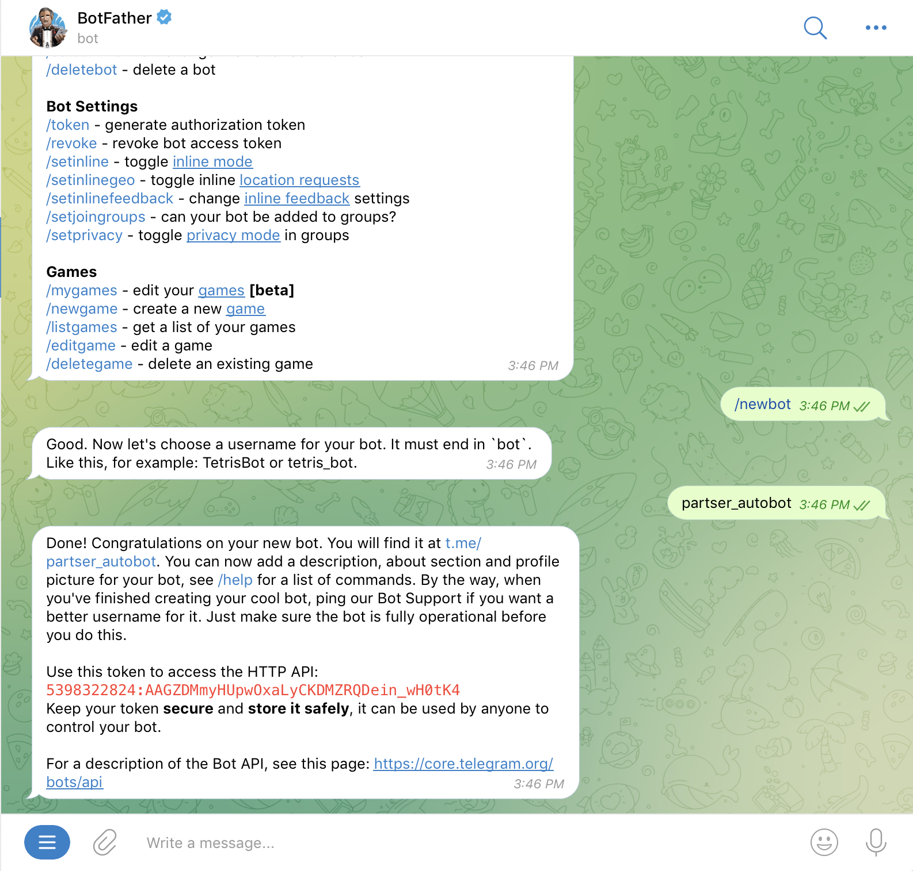
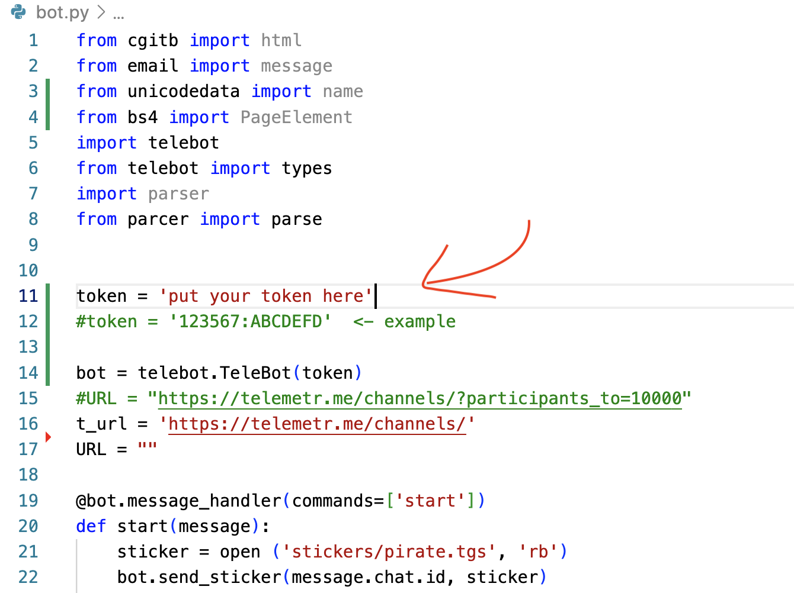

# Персер-телеграм бот на python [Parcer Telemetr Bot on python]

Парсер сайта [Website Parser] https://telemetr.me/

## Установка [Installing]

### Клонируем проект [Cloning project]:

`git clone https://github.com/lcaitlyn/parser_telemetr.git`

### Устанавливаем пакеты [Install packets]:

`python3 -m pip install pyTelegramBotAPI requests bs4`

### Создаём бота телеграм [Creating a Telegram bot]

Открываем телеграм и ищем @botfather [Open telegram and search @botfather]

Запускаем BotFather и создаем нового бота [Start BotFather and creat a new bot]

Переходим в папку [Go to the folder]:

`cd parser_telemetr`

Открываем bot.py и вставляем наш token [Open bot.py and put out token]

## Запуск [Launch]

`python3 bot.py`

Открываем наш бот телеграм и нажимаем /start [Open bot in telegram and /start]