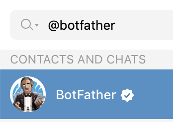
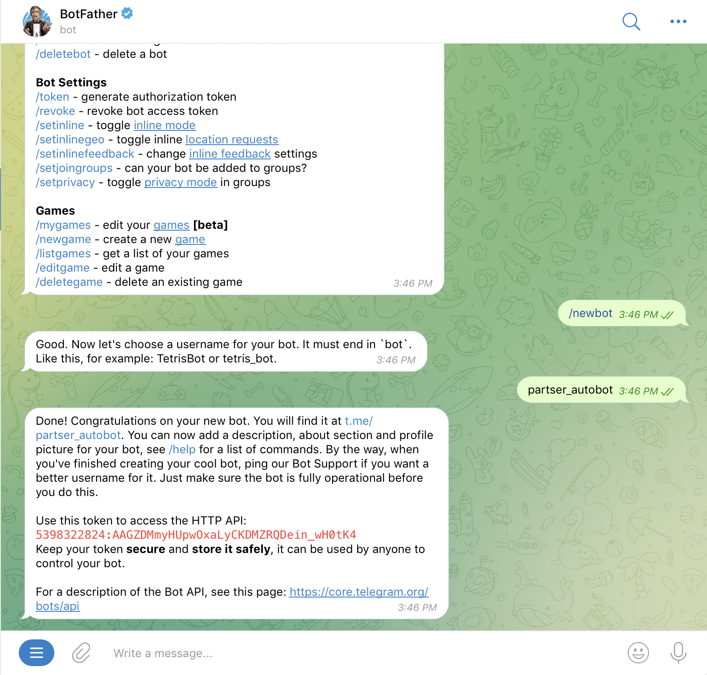
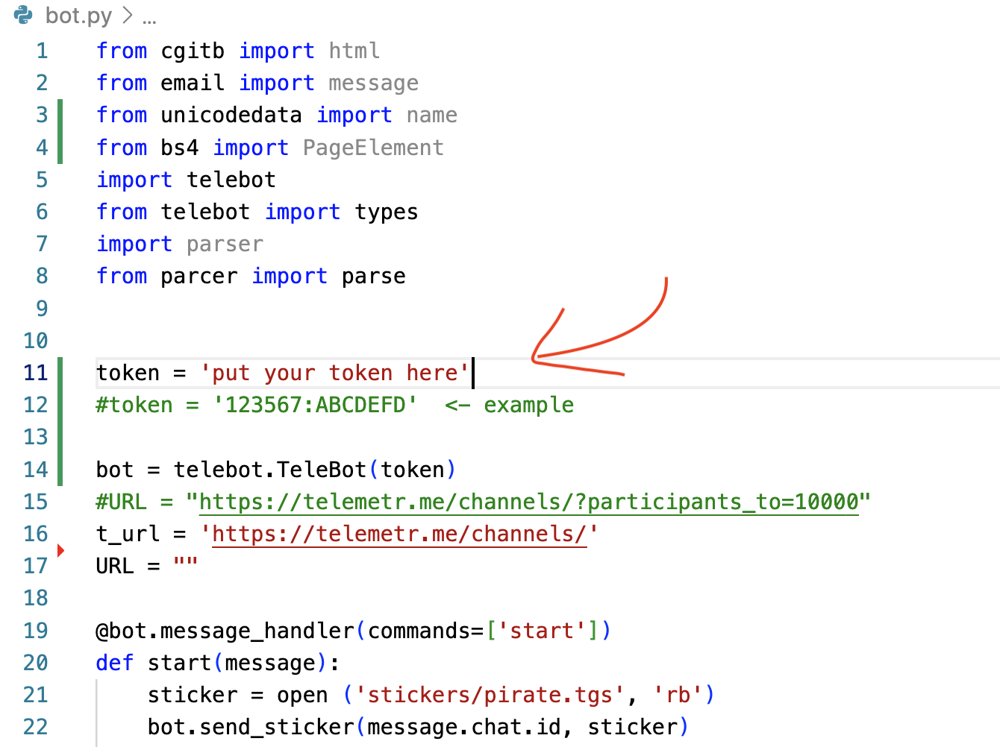
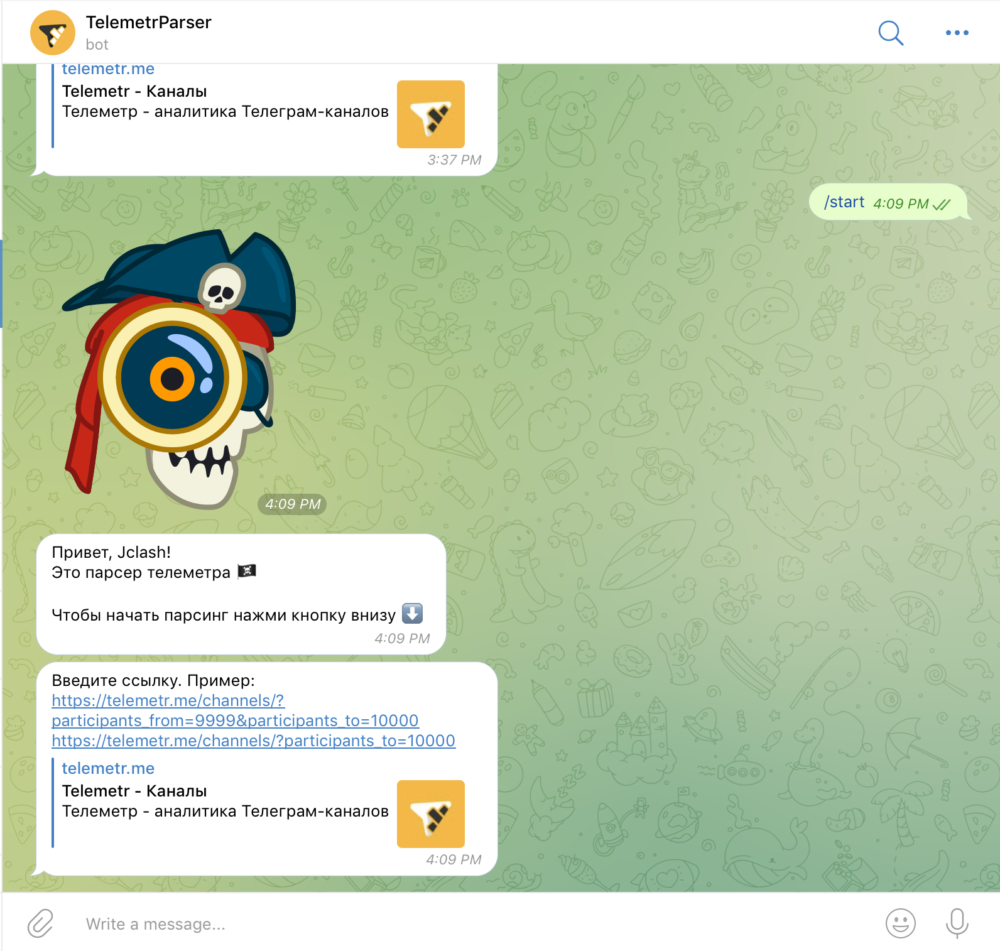
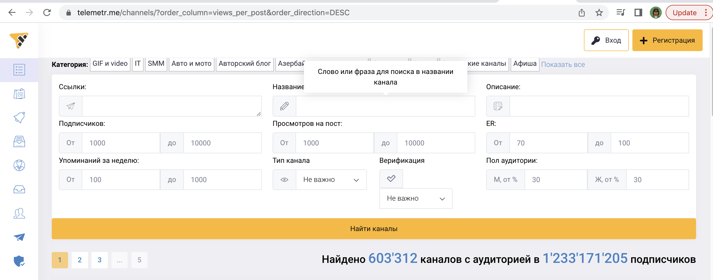

# Персер-телеграм бот на python [Parcer Telemetr Bot on python]

Парсер сайта [Website Parser] https://telemetr.me/

## Установка [Installing]

### Клонируем проект [Cloning project]:

```
git clone https://github.com/lcaitlyn/parser_telemetr.git
```

### Устанавливаем пакеты [Install packets]:

```
python3 -m pip install pyTelegramBotAPI requests bs4
```

### Создаём бота телеграм [Creating a Telegram bot]

Открываем телеграм и ищем @botfather [Open telegram and search @botfather]



Запускаем BotFather и создаем нового бота [Start BotFather and creat a new bot]



Переходим в папку [Go to the folder]:

```
cd parser_telemetr
```

Открываем bot.py и вставляем наш token [Open bot.py and put out token]



## Запуск [Launch]

```
python3 bot.py
```

Если выходит ошибка с токеном [If there is a token error]

`https://api.telegram.org/bot<token>/setWebhook`

Вместо "<token>" вставьте ваш токен (123456:ABCDEF)
Instead of "<token>" insert your token (123456:ABCDEF)


Открываем наш бот телеграм и нажимаем /start [Open bot in telegram and /start]



Ссылку можно получить на сайте, заполнив таблицу
[The link can be obtained from the website by filling out the table]
https://telemetr.me/channels/?order_column=views_per_post&order_direction=DESC



### Чтобы оставновить [How to stop]

Ctrl + Z
